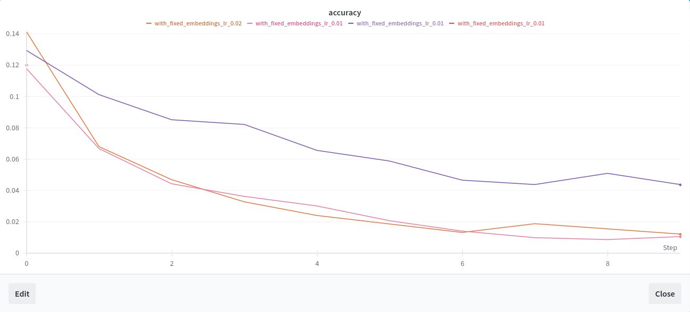
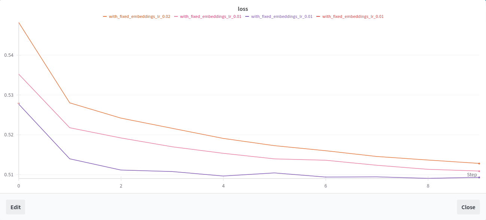
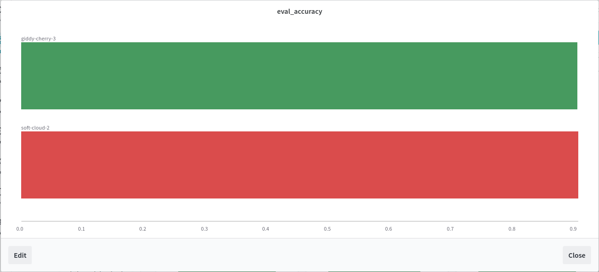
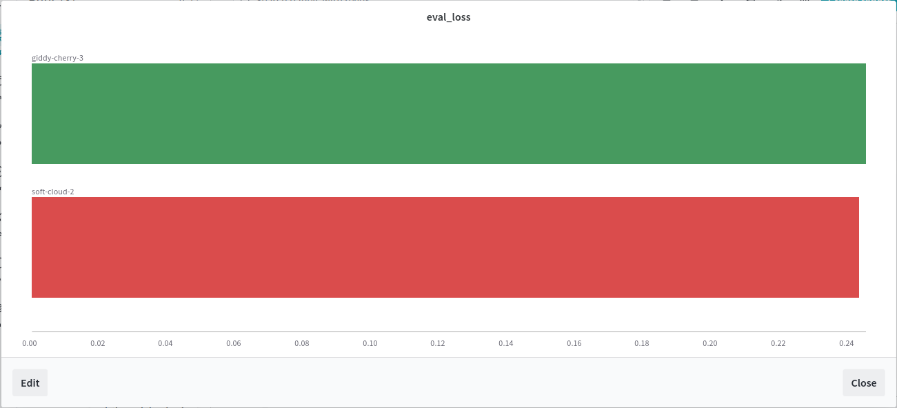

# Wyniki

Pierwszym modelem, jaki omówię, będzie też pierwszy model, który zrobiłam. Pierwszy, bo jego wyniki były tak tragiczne, że postanowiłam spróbować innego podejścia.

## Keras model

Koncepcja modelu zdawała mi się dobra: ponieważ zadanie, przy ocenianiu nacechowania emocjonalnego, wymagało odniesienia do kontekstu całej opinii, chciałam zrobić model, który ma dwa wejścia:

- cała opinia w formie długiego stringa
- zdanie do ewaluacji w formie stringa

i jedno wyjście:

- wektor o długości 11, składający się z 0 (reprezentujących fałsz) i 1 (reprezentujących prawdę)

### Co i jak?

1. Instalowanie modułów i importy (to nie ta ciekawa część)
2. Pobranie danych z githuba i wsadzenie ich do ramek (DataFrame) biblioteki pandas.
3. Preprocessing 1 - podzielenie danych na opinie - każda opinia to tablica stringów, zbiór danych to tablica takich tablic.
4. Preprocessing 2 - stworzenie z tablicy opinii dwóch tablic OPINIE i ZDANIA takich, że OPINIE[i] to tekst opinii zawierającej zdanie ZDANIA[i], z zachowaniem kolejności zdań ustalonych na wejściu. Zamiast '##...#' w zdaniach jest wstawiony drugi raz pełen tekst opinii. Na tym etapie funkcji preprocessingowych przewinęło się bardzo dużo, bo nie wiedziałam jakiego formatu wymaga wejście do sieci neuronowej Kerasa. (Przeczytałam po drodze wiele błędów o niezgodności rozmiarów wektorów, kiedy chciałam do sieci wpuścić tekst już przepuszczony przez warstwę TextVectorizer)
5. Preprocessing 3 - Zamiana ramki z wartościami True i False na izomorficzną tablicę tablic z wartościami 1 i 0 (etykietami).
6. Adapracja wektoryzującej warstwy z Kerasa (TextVectorization) z pomocą danych wejściowych.
7. Stworzenie warstwy zanurzenia z Kerasa (Embedding) z pomocą gotowego zbioru wektorów słów ze spaCy.
8. Budowa sieci neuronowej - wzorowałam się na tej z naszych ćwiczeń **attentionrnn**, ale musiałam jakoś poradzić sobie z podwójnym wejściem oraz 11 wyjściami odpowiadającymi zerom i jedynkom etykiet.Funkcją straty jest _binary cross entropy_ bo wyczytałam gdzieś, że nadaje się do klasyfikacji wieloetykietowej. Z kodem w tym miejscu pomógł mi Chat GPT, ponieważ nie poradziłam sobie z samodzielnym zrozumieniem, od czego zależy kształt wektorów wejściowych i wyjściowych przetwarzanych przez sieć.
9. Tworzenie projektu do logów w wandb.
10. Trening modelu.

Nie sprawdzałam, jak model radzi sobie dla danych innych niż treningowe, ponieważ nawet na tych treningowych dokładność (accuracy) spadała z każdą epoką, i to coraz wyraźniej wraz z kolejnymi zmienami parametrów i dodawaniem warstw. Strata (loss) z kolei też niby spada, ale tak naprawdę utrzymuje się wciąż powyżej 0.5, co uważam za tragiczny wynik. I szczerze mówiąc, nie mam pojęcia jak to się dzieje.Poniżej wykresy z poszczególnych przebiegów treningu.

## HerBERT model

Po absolutnej porażce z Kerasem koleżanka z zajęć podpowiedziała mi, że można przecież dotrenować istniejący model, zamiast tworzyć własny. Przy pisaniu tej wersji Chat GPT pomagał mi jeszcze bardziej niż przy Kerasie, bo miałam już mało czasu na zrozumienie, co dokładnie powinnam zrobić. Tym razem wejście było jedno:

- tablica zawierająca: treść opinii + treść zdania do ewaluacji, jako jeden string

wyjście również:

- tablica wektorów 0 i 1 (alternatyw False i True)

Dane podzieliłam w proporcji 4:1, 4 dla treningu, 1 dla walidacji.

### Co i jak?

1. Instalowanie modułów do logów i preprocessingu, oraz paru innych, bez których BERT nie chciał działać (wziełam je z błędów o ich braku).
2. Preprocessing analogiczny do tego przy Kerasie, z tym że sklejałam stringi opinii ze zdaniami do ewaluacji.
3. Importy modułów typowo do tworzenia zbiorów danych i trenowania HerBERTa.
4. Preprocessing 2 - zamiana tablicy z oczekiwanym wyjściem na tensor i tokenizacja stringów wejściowych.
5. Definicja funkcji dokładności (accuracy) - z braku wbudowanej.
6. Stworzenie klasy reprezentującej zbiór danych o wielu etykietach i podział zbioru danych treningowych na faktycznie treningowe i walidacyjne.
7. Definicja funkcji straty dla wielu etykiet na wyjściu
8. Definicja argumentów do treningu modelu na podstawie tej, którą dostaliśmy na ćwiczeniach **encoders**
9. Definicja trenera dla modelu HerBert
10. Tworzenie projektu do logów w wandb.
11. Trening modelu i logowanie.

Niestety, przy treningu tego modelu Google Colab odebrał mi dostęp do GPU (już na moim drugim koncie, na pierwszym się skończyło jeszcze przy treningu Kerasa), więc mam tylko dwa wyniki:

Zielony: 0.9042
Czerwony: 0.9056

Zielony: 0.2451
Czerwony: 0.2431

Z racji ograniczeń google collaba, nie zanosi się, żebym była w stanie wytrenować ten model więcej razy, ani też wygenerować cokolwik dla faktycznych danych testowych.

## Podsumowanie

- Keras: szybszy w treningu, ale absolutnie nieskuteczny przy moim podejściu
- HerBERT: trening trwa wieki, ale za to ma wybitną skuteczność

Dziękuję za czas poświęcony na przeanalizowanie mojego projektu, mam nadzieję, że mimo pierwszych tragicznych wyników oraz, połowicznie, składania modeli z "puzzli" od chatu GPT (wiedziałam _co_ chcę zrobić, po części nie wiedziałam _jak_...), nie będę musiała zajmować Pańskiego czasu w drugim terminie ^^'
